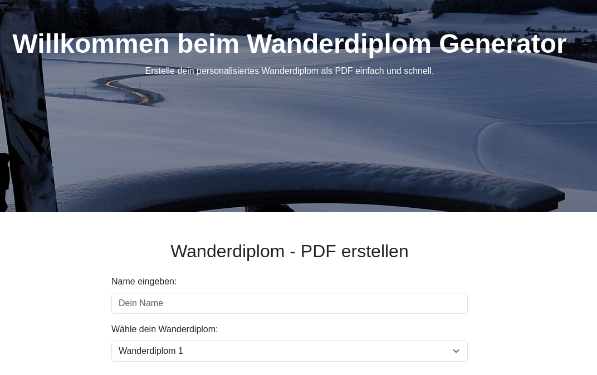

# Wanderdiplom Generator




## About

The Wanderdiplom Generator is a mostly AI-gernated web application. It allows users to create personalized hiking diplomas (Wanderdiploms) as PDF files. Users can input their name, select a diploma type, and download the generated PDF.

## Prerequisites

Make sure Python 3 and `pip` are installed. Install the dependencies listed in the `requirements.txt` file:

```bash
pip install -r requirements.txt
```

## Running the Application

1. Start the Flask application with the following command:

```bash
python app.py
```

1. Open a web browser and navigate to `http://127.0.0.1:5000` to use the application.

## Notes

- The generated PDF files will be saved in the `outputs` directory.
- Ensure that the templates are available in the `templates` directory, especially the files `wanderdiplom1.pdf`, `wanderdiplom2.pdf`, and `wanderdiplom3.pdf`.
